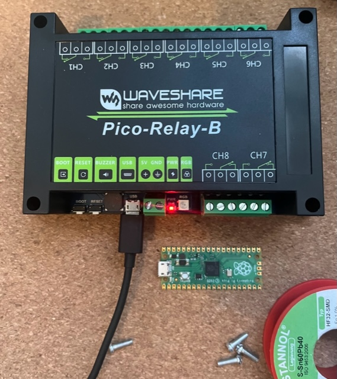

# Controlling Relays from Go

This pure Go implementation allows one to control the outputs off the [Waveshare Pico Relay B](https://www.waveshare.com/wiki/Pico-Relay-B)



## Intro

Sometimes control is needed. This project aims to provide control over the eight relays attached to the Raspberry Pi Pico µC. The project is split into two parts one part is the firmware and the other one is the command line client to set the state from a connected host device.


## Firmware

It looks like flashing from the dev Container is not supported, so I build the binary and manually copy it onto the Raspberry Pi Pico


### Build

```
$ tinygo build -size short -o firmware.uf2 -target=pico ./firmware
```

## License

This software is licensed under the [Apache License Version 2.0](LICENSE)